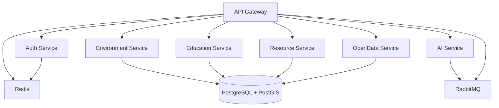

# 📚 GreenEduMap Services Documentation

Tài liệu chi tiết về các microservices trong hệ thống **GreenEduMap**.

---

## 🏗️ Kiến trúc Microservices

```
┌─────────────────────────────────────────────────────┐
│                   Client Layer                      │
│  (Web App, Mobile App, External Services)          │
└──────────────────────┬──────────────────────────────┘
                       │
                       ↓
┌─────────────────────────────────────────────────────┐
│              API Gateway (Port 8000)                │
│  - Service Routing                                  │
│  - Rate Limiting                                    │
│  - CORS Handling                                    │
│  - Public OpenData API                              │
└──────────────────────┬──────────────────────────────┘
                       │
         ┌─────────────┼─────────────┬─────────────┐
         │             │             │             │
         ↓             ↓             ↓             ↓
┌────────────┐  ┌────────────┐  ┌────────────┐  ┌────────────┐
│   Auth     │  │Environment │  │ Education  │  │ Resource   │
│  Service   │  │  Service   │  │  Service   │  │  Service   │
│ (Port 8001)│  │(Port 8007) │  │(Port 8008) │  │(Port 8004) │
└────────────┘  └────────────┘  └────────────┘  └────────────┘
         │             │             │             │
         ↓             ↓             ↓             ↓
┌────────────┐  ┌────────────┐  ┌─────────────────────────┐
│  OpenData  │  │    AI      │  │   Shared Infrastructure │
│  Service   │  │  Service   │  │  - PostgreSQL + PostGIS │
│(Port 8009) │  │(Port 8006) │  │  - RabbitMQ             │
└────────────┘  └────────────┘  │  - Redis                │
                                 └─────────────────────────┘
```

---

## 📋 Danh sách Services

### 🌐 [API Gateway Service](./APIGatewayService/Readme.md)
**Port:** 8000 | **Tech:** Python + FastAPI

Cổng trung tâm cho tất cả các microservices:
- Service routing và orchestration
- Public OpenData API (không cần xác thực)
- NGSI-LD endpoints
- Rate limiting và CORS
- Health check aggregation

---

### 🔐 [Auth Service](./AuthService/Readme.md)
**Port:** 8001 | **Tech:** Python + FastAPI | **DB:** PostgreSQL

Xác thực và phân quyền:
- User registration & login
- JWT authentication (access + refresh tokens)
- Role-based access control (RBAC)
- API key management
- Password hashing (bcrypt)

**User Roles:** admin, developer, volunteer, citizen, school

---

### 🎓 [Education Service](./EducationService/Readme.md)
**Port:** 8008 | **Tech:** Python + FastAPI | **DB:** PostgreSQL + PostGIS

Quản lý trường học và giáo dục xanh:
- Schools management với PostGIS
- Green courses tracking
- Green score calculation (0-100)
- Spatial queries (nearby schools)
- OpenData compliance

---

### 🌍 [Environment Service](./EnvironmentService/Readme.md)
**Port:** 8007 | **Tech:** Python + FastAPI | **DB:** PostgreSQL + PostGIS

Dữ liệu môi trường từ external APIs:
- **OpenAQ API**: Air quality data (PM2.5, PM10, AQI)
- **OpenWeather API**: Weather data & forecasts
- NGSI-LD entity creation
- Scheduled data fetching (APScheduler)
- Spatial queries

---

### 🌐 [OpenData Service](./OpenDataService/Readme.md)
**Port:** 8009 | **Tech:** Python + FastAPI | **DB:** PostgreSQL (read-only)

Truy cập mở theo chuẩn quốc tế:
- **NGSI-LD**: Smart Cities standard (ETSI GS CIM 009)
- **DCAT-AP**: Data catalog (v2.1.1)
- **Export formats**: CSV, GeoJSON, RDF (Turtle, N-Triples, JSON-LD)
- Linked Data vocabularies
- OLP 2025 ready

---

### 🌳 [Resource Service](./ResourceService/Readme.md)
**Port:** 8004 | **Tech:** Python + FastAPI | **DB:** PostgreSQL + PostGIS

Quản lý tài nguyên xanh:
- Green zones management (parks, gardens, forests)
- Green resources tracking
- Rescue centers management
- PostGIS spatial queries
- Resource allocation

---

### 🤖 [AI Service](./AIService/Readme.md)
**Port:** 8006 | **Tech:** Python + FastAPI | **Queue:** RabbitMQ

Machine Learning cho GreenEduMap:
- **Clustering**: Phân vùng xanh/vàng/đỏ (K-Means)
- **Prediction**: Dự báo AQI 7 ngày (Linear Regression)
- **Correlation**: Phân tích tương quan môi trường-giáo dục
- RabbitMQ consumers
- Async task processing

---

## 🔗 Service Dependencies



---

## 🚀 Quick Start

### Prerequisites
- Docker & Docker Compose
- PostgreSQL 15 + PostGIS
- RabbitMQ
- Redis

### Run All Services

```bash
cd infrastructure/docker
docker-compose up -d
```

### Access Services

| Service | URL | Documentation |
|---------|-----|---------------|
| API Gateway | http://localhost:8000 | http://localhost:8000/docs |
| Auth Service | http://localhost:8001 | http://localhost:8001/docs |
| Resource Service | http://localhost:8004 | http://localhost:8004/docs |
| AI Service | http://localhost:8006 | http://localhost:8006/docs |
| Environment Service | http://localhost:8007 | http://localhost:8007/docs |
| Education Service | http://localhost:8008 | http://localhost:8008/docs |
| OpenData Service | http://localhost:8009 | http://localhost:8009/docs |

---

## 🛠️ Technology Stack

### Backend Framework
- **FastAPI** - Modern, fast web framework for Python
- **SQLAlchemy** - Async ORM
- **Pydantic v2** - Data validation

### Databases
- **PostgreSQL 15** - Primary database
- **PostGIS** - Geospatial extension
- **Redis** - Caching & rate limiting

### Message Queue
- **RabbitMQ** - Async task processing

### External APIs
- **OpenAQ** - Air quality data
- **OpenWeather** - Weather data

### Standards Compliance
- **NGSI-LD** - Smart Cities (ETSI GS CIM 009)
- **DCAT-AP** - Data catalog (v2.1.1)
- **GeoJSON** - Geographic data (RFC 7946)
- **RDF** - Linked Data

---

## 📊 Service Ports

| Port | Service | Protocol |
|------|---------|----------|
| 8000 | API Gateway | HTTP |
| 8001 | Auth Service | HTTP |
| 8004 | Resource Service | HTTP |
| 8006 | AI Service | HTTP |
| 8007 | Environment Service | HTTP |
| 8008 | Education Service | HTTP |
| 8009 | OpenData Service | HTTP |
| 5432 | PostgreSQL | TCP |
| 5672 | RabbitMQ | AMQP |
| 6379 | Redis | TCP |

---

## 🔒 Security

- **JWT Authentication**: Access + refresh tokens
- **Password Hashing**: Bcrypt (12 rounds)
- **API Keys**: For developer access
- **Rate Limiting**: Per-IP and per-key limits
- **CORS**: Configurable origins
- **RBAC**: Role-based access control

---

## 📈 Monitoring

- **Health Checks**: `/health` endpoint on all services
- **Metrics**: Prometheus-compatible `/metrics`
- **Logging**: Structured JSON logs
- **Tracing**: Distributed tracing with correlation IDs

---

## 📄 License

Dự án này được phân phối dưới [GNU General Public License v3.0](https://github.com/HoDuongQuocHuy278/GreenEduMap-DTUDZ/blob/main/LICENSE).
